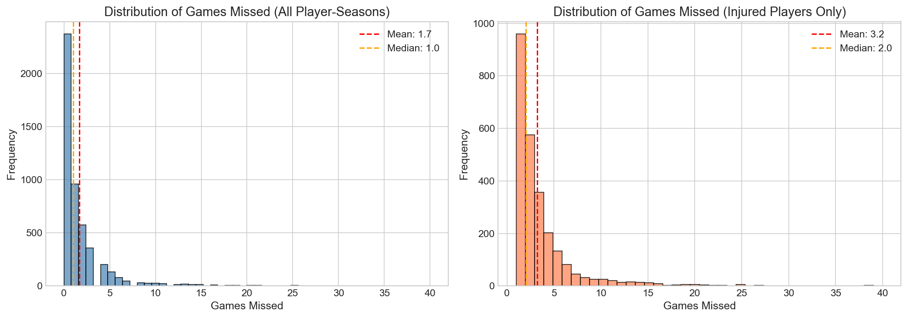
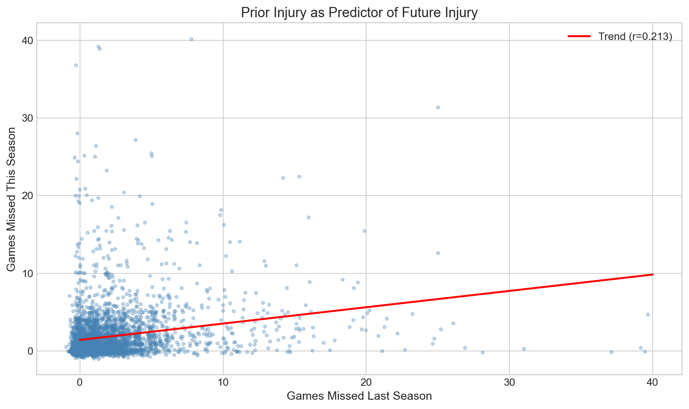
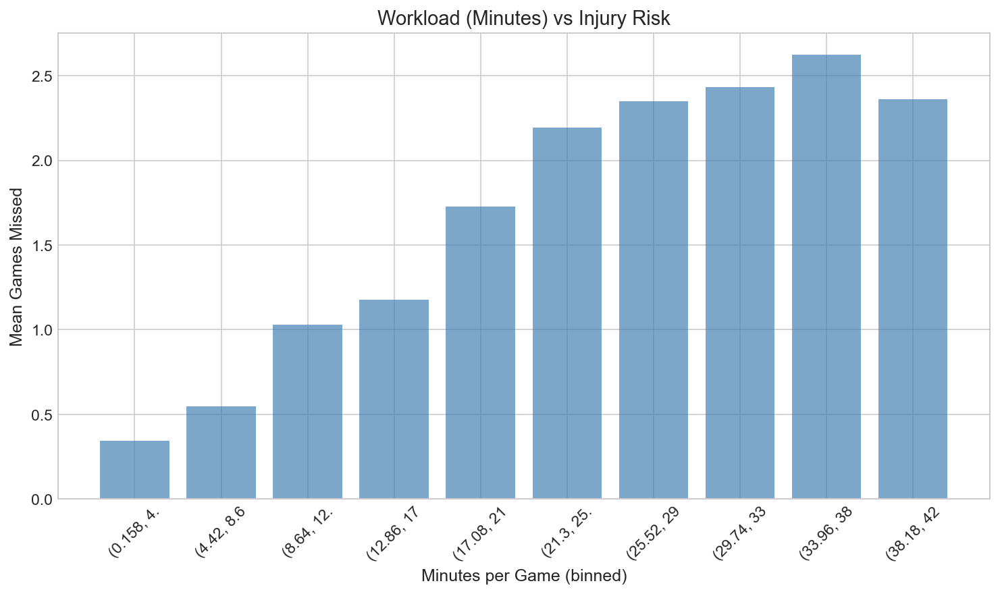
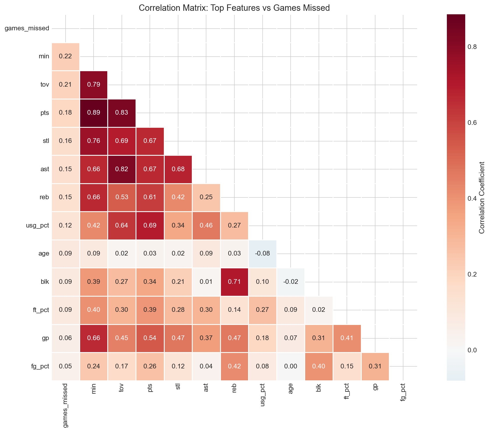

# NBA Injury Risk Prediction

## Overview

This project explores whether NBA player statistics, workload, physical attributes, injury history, and team schedule context can be used to predict a player's number of **injury-report appearances in the following season**.

Using historical NBA injury records and official NBA statistics, we developed an end-to-end machine learning pipeline covering data collection, cleaning, player matching, exploratory analysis, feature engineering, supervised learning, and unsupervised clustering.

The final supervised-learning dataset contained **2,032 player-season observations** with **15 predictive features**. Linear Regression, Random Forest, and XGBoost were evaluated against a mean-prediction baseline using a temporal train/test split and five-fold cross-validation.

The results highlight an important modeling challenge: next-season injury-report frequency contains a relatively weak predictive signal. More complex models did not consistently outperform simpler approaches, emphasizing the importance of careful validation, error analysis, and transparent interpretation.

---

## Full Project Report

For the complete methodology, analysis, visualizations, results, limitations, ethical considerations, and discussion:

**[View Full Project Report (PDF)](./Project_Report.pdf)**

---

## Research Question

**Can historical player statistics, workload, physical characteristics, injury history, and team schedule context help predict how frequently an NBA player will appear on injury reports in the following season?**

The project also explored whether NBA players naturally form distinct injury-risk or workload archetypes using unsupervised learning.

---

## Data Sources

### NBA Injury Records

Historical injury transaction records were obtained from the **elap733 NBA Injury Data** repository, which contains injury information originally collected from Pro Sports Transactions.

The analysis used injury records spanning the **2013-14 through 2018-19 NBA seasons**.

After filtering non-injury transactions and aggregating records to the player-season level, the injury data contained **1,503 injury records**.

Source: [NBA Injury Data](https://github.com/elap733/NBA-Injury-Data)

### NBA Statistics

Official NBA statistics were retrieved using the **nba_api** Python package.

The project collected multiple categories of player and team data, including:

- Games played
- Minutes played
- Player age
- Height and weight
- Usage statistics
- Player tracking metrics
- Distance traveled
- Average speed
- Team schedules
- Back-to-back games

After combining the season-level NBA data, the integrated statistical dataset contained **3,006 player-season observations** covering the study period.

Source: [nba_api](https://github.com/swar/nba_api)

---

## Data Preparation & Integration

The injury and NBA statistics datasets used different player identifiers and naming conventions, requiring a multi-step matching process.

Player records were matched using:

- Exact name matching
- Standardized player names
- Manual mappings for known naming differences
- Fuzzy matching for unresolved records

This process achieved a **99.2% player-matching rate across 602 unique players**.

The resulting player-season dataset combined injury history with player statistics, physical characteristics, tracking metrics, and team schedule information.

---

## Prediction Target

The original injury source records player appearances on injury reports rather than a complete measure of literal games missed.

For that reason, the final regression target is defined as:

**Number of injury-report appearances in the following season**

A forward-shifted target was created so that each player's current-season characteristics were used to predict their injury-report count in the next season.

For example:

**2015-16 player data → predicts 2016-17 injury-report appearances**

This structure helps prevent future information from leaking into the prediction features.

---

## Feature Engineering

The final modeling dataset contained **15 predictive features** across several categories:

### Workload

- Minutes played
- Games played
- Distance traveled
- Usage percentage
- True shooting percentage

### Physical Characteristics

- Age
- Height
- Weight

### Injury History

- Whether the player was injured in the previous season
- Previous-season injury-report count

### Team Context

- Number of back-to-back games

### Interaction Features

- Age × minutes
- Weight × minutes
- Back-to-back games × minutes
- Age × weight

Missing values were imputed using training-set medians.

---

## Temporal Train/Test Split

Rather than randomly splitting observations across seasons, the project used a **temporal split** to better reflect a real prediction setting.

- **Training set:** 1,620 player-season observations from 2013-14 through 2016-17
- **Test set:** 412 observations using 2017-18 features to predict 2018-19 outcomes

This ensures that the models are evaluated on future observations rather than randomly selected records from the same time period.

---

## Supervised Machine Learning

Three regression models were evaluated:

- Linear Regression
- Random Forest
- XGBoost

A mean-prediction model was used as the baseline.

Five-fold cross-validation was used during model development, with additional tuning and evaluation of the tree-based models.

### Held-Out Test Results

| Model | MAE | RMSE | R² |
|---|---:|---:|---:|
| Baseline | 1.048 | 1.250 | -0.032 |
| **Linear Regression** | **0.928** | **1.172** | **0.093** |
| Random Forest | 0.964 | 1.211 | 0.033 |
| XGBoost | 0.941 | 1.189 | 0.067 |

Linear Regression achieved the **lowest held-out test MAE and RMSE and the highest test R²** among the evaluated models.

The relatively small improvement over the baseline and low R² values indicate that next-season injury-report frequency is difficult to predict using the available features.

The results also demonstrate that greater model complexity did not automatically improve generalization.

---

## Model Interpretation & Error Analysis

Feature-importance and ablation analyses were used to better understand the predictive models.

Within the XGBoost analysis:

- `age_x_minutes` received the highest feature-importance score.
- Removing the **injury-history feature group** increased MAE by approximately 0.015.
- Removing the workload feature group slightly improved MAE in the ablation experiment.

These findings suggest that historical injury information contributed useful predictive signal, while some workload variables may have added limited additional value within the evaluated XGBoost model.

The target distribution was also highly concentrated at zero, with approximately **50.7% of player-season observations containing zero injury reports**.

Failure analysis showed that the models had particular difficulty predicting rare seasons with unusually high injury-report counts, often producing conservative underpredictions.

---

## Unsupervised Learning

The project also investigated whether players naturally form distinct injury-risk or workload profiles.

Two clustering approaches were evaluated:

- K-Means Clustering
- Hierarchical Agglomerative Clustering

Cluster quality was assessed using:

- Silhouette scores
- Inertia
- PCA visualizations
- Dendrograms
- Cluster-size distributions

K-Means produced a maximum silhouette score of approximately **0.23**, indicating weak separation between player groups.

Hierarchical clustering produced higher silhouette scores under some configurations, but the strongest-scoring solutions were extremely imbalanced. For example, one two-cluster configuration contained **1,617 players in one cluster and only 3 in the other**.

Overall, the analysis did not provide strong evidence for clean, discrete injury-risk archetypes. Player characteristics appeared to vary more continuously than as clearly separated groups.

---

## Key Findings

1. **Injury prediction is difficult.**  
   All supervised models produced relatively low R² values, suggesting that the available player and workload features explain only a limited portion of future injury-report variation.

2. **Simple models remained competitive.**  
   Linear Regression produced the strongest held-out test metrics despite evaluating more complex Random Forest and XGBoost models.

3. **Prior injury information contributed useful predictive signal.**  
   Removing the injury-history feature group worsened XGBoost performance in the ablation analysis.

4. **Rare high-injury seasons were difficult to predict.**  
   The models tended to underestimate unusually high injury-report counts.

5. **Player profiles did not form strong natural clusters.**  
   Clustering results suggested substantial overlap between player profiles rather than clearly separated injury-risk categories.

---

## Visualizations

The project includes visualizations covering exploratory analysis and model interpretation.

Examples include:

### Target Distribution



### Prior Injury vs. Future Injury



### Workload vs. Injury



### Correlation Heatmap



Additional visualizations are available in the `figures/` directory and project notebooks.

---

## Project Notebooks

The analysis workflow is organized into six Jupyter notebooks:

1. **[Data Collection](./notebooks/01_data_collection.ipynb)**  
   Collects historical NBA statistics, player information, tracking metrics, schedules, and injury data.

2. **[Data Cleaning & Integration](./notebooks/02_data_cleaning.ipynb)**  
   Cleans the source data, standardizes player records, performs player-ID matching, and integrates injury and NBA statistics.

3. **[Exploratory Data Analysis](./notebooks/03_eda.ipynb)**  
   Examines the injury-report target, player characteristics, workload patterns, correlations, and temporal trends.

4. **[Feature Engineering](./notebooks/04_feature_engineering.ipynb)**  
   Constructs the forward-looking target, creates modeling features, handles missing values, and builds the temporal train/test split.

5. **[Supervised Machine Learning](./notebooks/05_supervised_models.ipynb)**  
   Evaluates Linear Regression, Random Forest, and XGBoost using cross-validation, held-out testing, feature analysis, ablation analysis, sensitivity analysis, and failure analysis.

6. **[Unsupervised Learning](./notebooks/06_unsupervised_models.ipynb)**  
   Explores K-Means and hierarchical clustering using silhouette scores, PCA visualization, dendrograms, and sensitivity analysis.

---

## Processed Data

The repository includes selected processed datasets used in the analytical pipeline:

- **[Integrated Player-Season Dataset](./data/processed/analysis_merged.csv)**
- **[Training Dataset](./data/processed/train.csv)**
- **[Test Dataset](./data/processed/test.csv)**

Large and intermediate source datasets are not duplicated in this repository. The original public data sources are linked above.

---

## Repository Structure

```text
nba-injury-risk-prediction/
│
├── data/
│   └── processed/
│       ├── analysis_merged.csv
│       ├── train.csv
│       └── test.csv
│
├── figures/
│   ├── correlation_heatmap.png
│   ├── injury_by_age_position.png
│   ├── injury_trend_by_season.png
│   ├── prior_injury_vs_future.png
│   ├── target_distribution.png
│   └── workload_vs_injury.png
│
├── notebooks/
│   ├── 01_data_collection.ipynb
│   ├── 02_data_cleaning.ipynb
│   ├── 03_eda.ipynb
│   ├── 04_feature_engineering.ipynb
│   ├── 05_supervised_models.ipynb
│   └── 06_unsupervised_models.ipynb
│
├── src/
│   ├── config.py
│   └── utils.py
│
├── .gitignore
├── Project_Report.pdf
├── README.md
└── requirements.txt
```

---

## Technologies & Methods

**Programming & Data:** Python, pandas, NumPy, SciPy

**Machine Learning:** Linear Regression, Random Forest, XGBoost, K-Means, Hierarchical Clustering

**Model Evaluation:** Cross-Validation, MAE, RMSE, R², Feature Importance, Ablation Analysis, Sensitivity Analysis, Failure Analysis

**Data Engineering:** NBA API, Data Cleaning, Data Integration, Entity Matching, Fuzzy Matching, Temporal Data Preparation

**Visualization:** Matplotlib, Seaborn, PCA Visualization, Correlation Heatmaps

**Development:** Jupyter Notebook, Git, GitHub

---

## Limitations

Several limitations are important when interpreting the results:

- Injury-report appearances are not equivalent to the exact number of games missed.
- Injury events are inherently difficult to predict and can occur without strong historical warning.
- The target distribution contains a large proportion of zero-injury observations.
- Historical injury reporting may contain inconsistencies or differences in reporting practices.
- Player workload and tracking data do not capture every medical, biomechanical, or contextual factor related to injury.
- The dataset covers a limited historical period.
- Clustering results showed weak or highly imbalanced structure and should not be interpreted as definitive player risk categories.

Future work could explore injury-type information, multi-season workload trends, classification approaches, zero-inflated count models, additional longitudinal features, and alternative clustering or representation-learning techniques.

---

## Ethical Considerations

Injury-risk modeling should be interpreted cautiously.

Predictions could potentially affect player reputation, playing-time decisions, or contract discussions despite substantial uncertainty in model performance. The results should therefore be treated as exploratory decision-support information rather than medical assessments or definitive evaluations of individual players.

Similarly, clustering labels should not be treated as fixed descriptions of a player's health or future injury risk.

---

## My Contribution

This project was completed collaboratively as part of **SIADS 696: Milestone II** in the University of Michigan Master of Applied Data Science program.

My primary contributions were:

- **Co-leading the supervised machine learning portion of the project**
- Contributing to model evaluation and interpretation
- **Leading development of the final technical report**
- Communicating the project's methodology, modeling results, limitations, ethical considerations, and conclusions

The repository presents the complete collaborative project workflow while this section distinguishes my individual contributions.

---

## Project Context

- **Program:** Master of Applied Data Science
- **Institution:** University of Michigan
- **Course:** SIADS 696 – Milestone II
- **Project Type:** Collaborative Machine Learning Project
